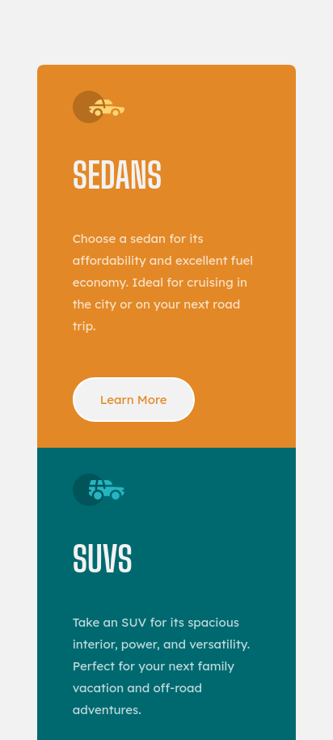

# Frontend Mentor - 3-column preview card component solution

This is a solution to the [3-column preview card component challenge on Frontend Mentor](https://www.frontendmentor.io/challenges/3column-preview-card-component-pH92eAR2-). Frontend Mentor challenges help you improve your coding skills by building realistic projects. 

## Table of contents

- [Overview](#overview)
  - [The challenge](#the-challenge)
  - [Screenshot](#screenshot)
- [My process](#my-process)
  - [Built with](#built-with)
  - [What I learned](#what-i-learned)
  - [Useful resources](#useful-resources)
- [Author](#author)

## Overview

### The challenge

Users should be able to:

- View the optimal layout depending on their device's screen size
- See hover states for interactive elements

### Screenshot

Desktop

Mobile (User has to scroll to see more)

## My process

### Built with

- Semantic HTML5 markup
- CSS custom properties
- CSS Flexbox
- CSS Grid

### What I learned

- Responsive Design
- Media Queries
- Psuedo-private custom properties

### Useful resources

- [Psuedo-private custom properties](https://lea.verou.me/blog/2021/10/custom-properties-with-defaults/) - This is an amazing article that taught me a pattern to help me avoid reptition in my CSS rules when giving elements in each column the background color of the column.
- [Tutorial: Learn how to use CSS Media Queries in less than 5 minutes](https://youtu.be/2KL-z9A56SQ) - This is a great video that helps you understand media queries quickly

## Author

- Frontend Mentor - [@grifb](https://www.frontendmentor.io/profile/grifb)
